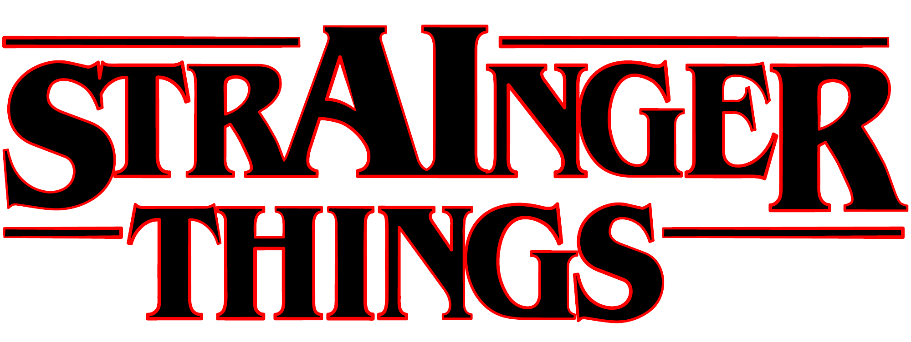
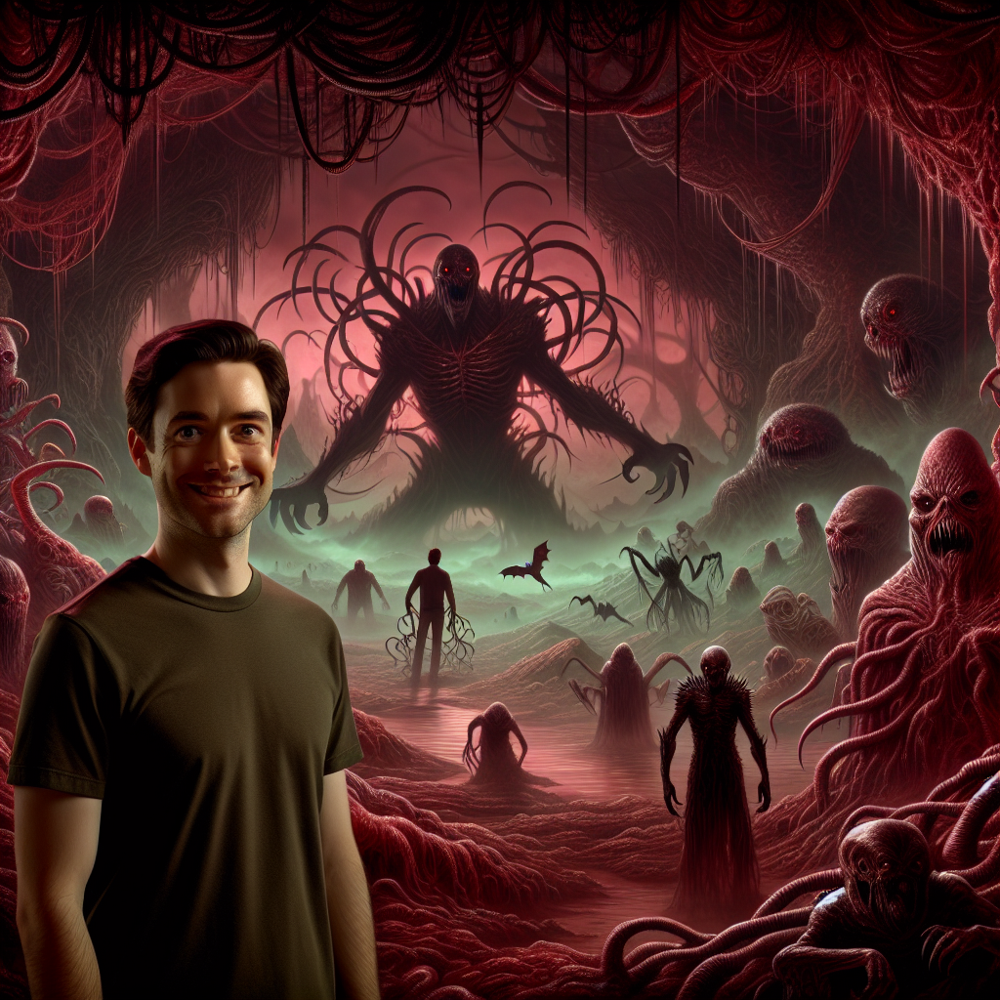
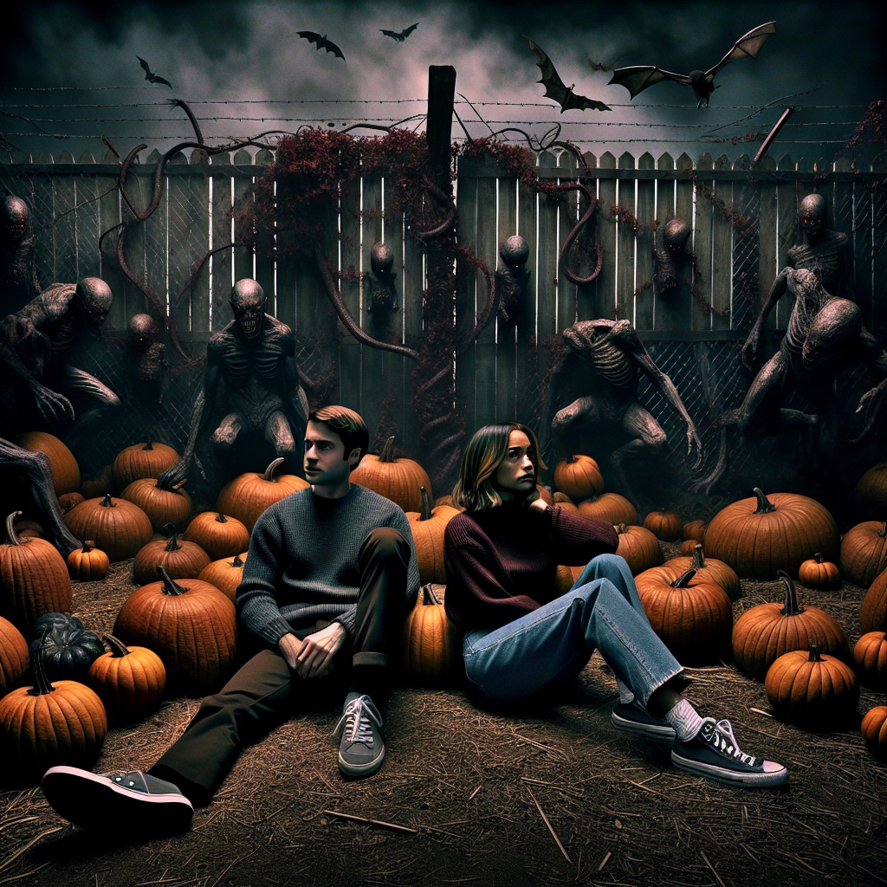
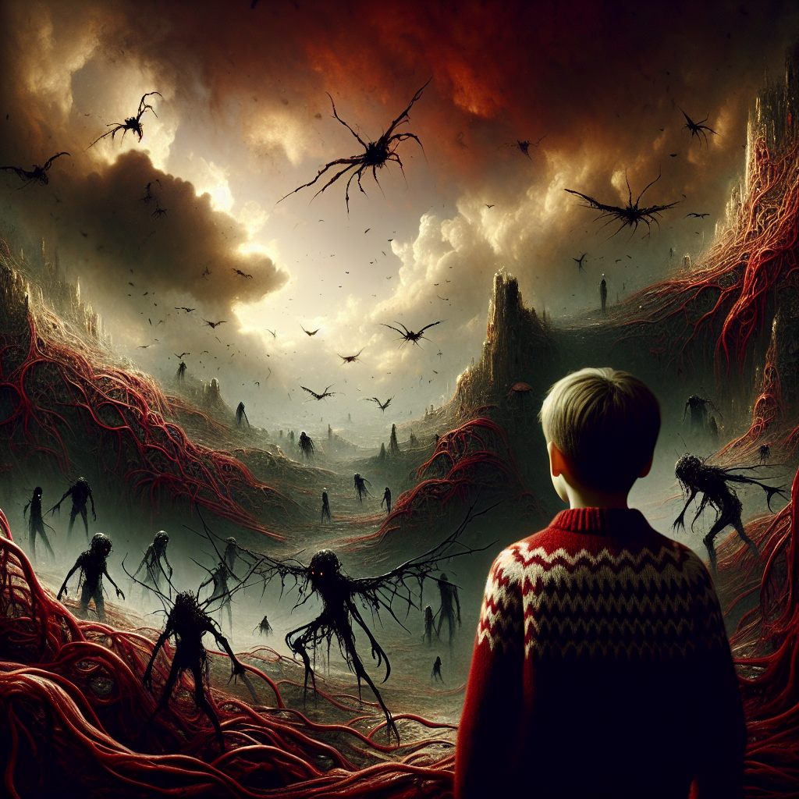
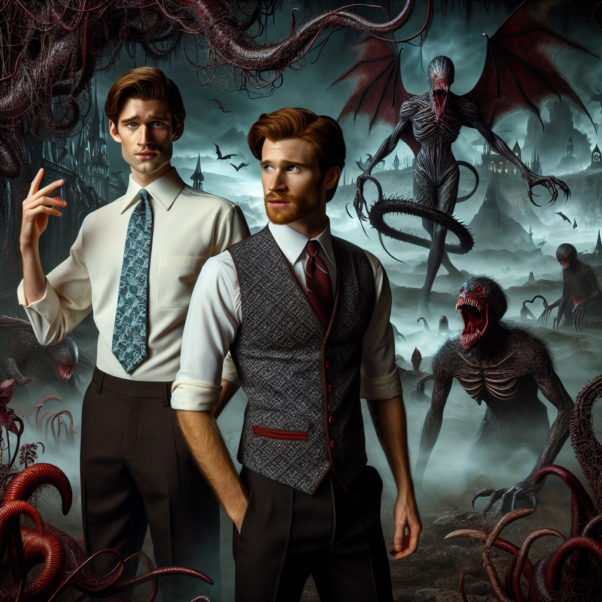
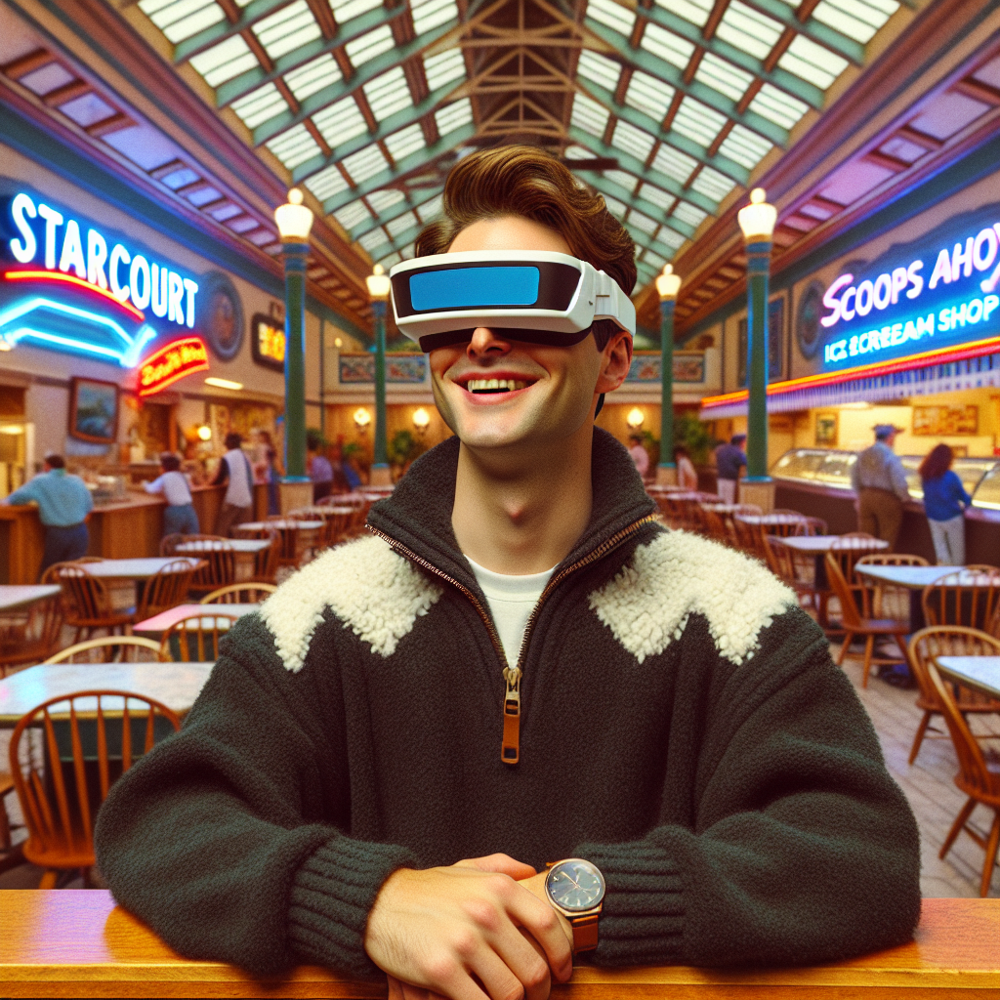
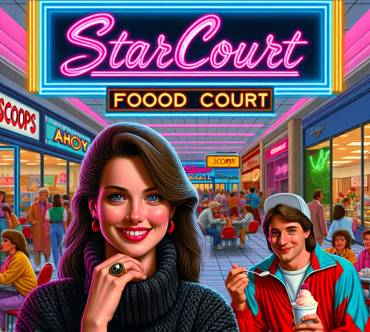
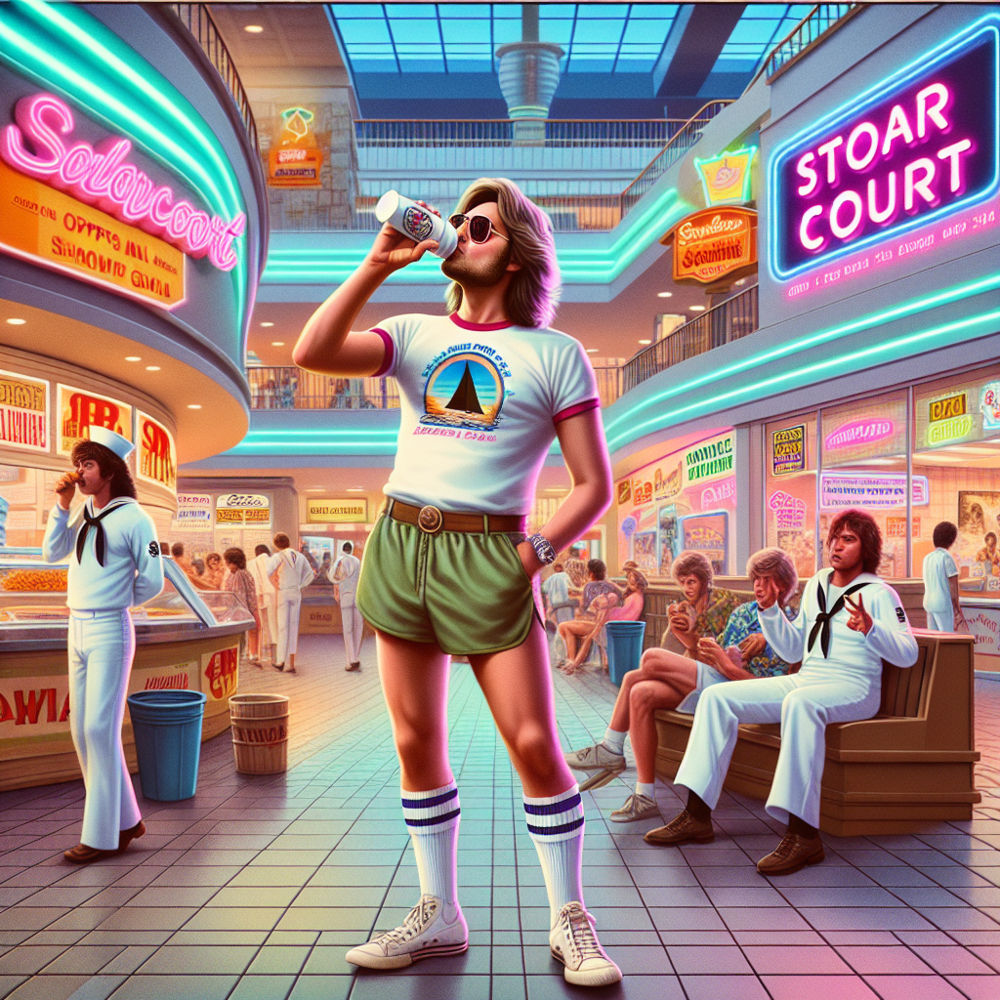
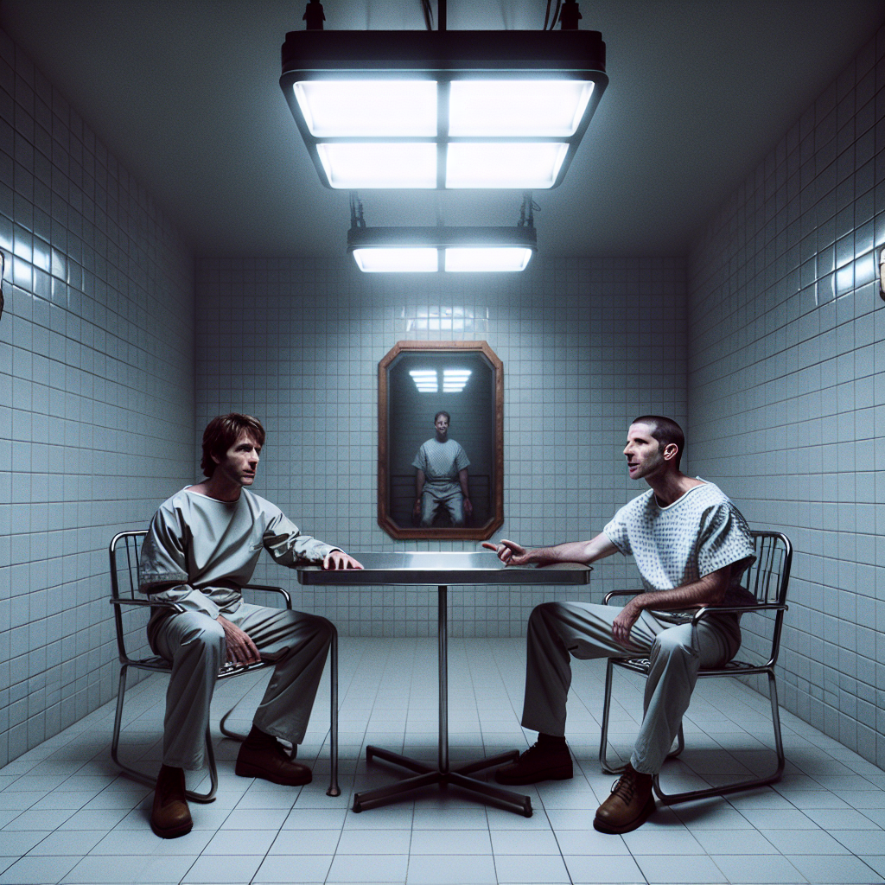
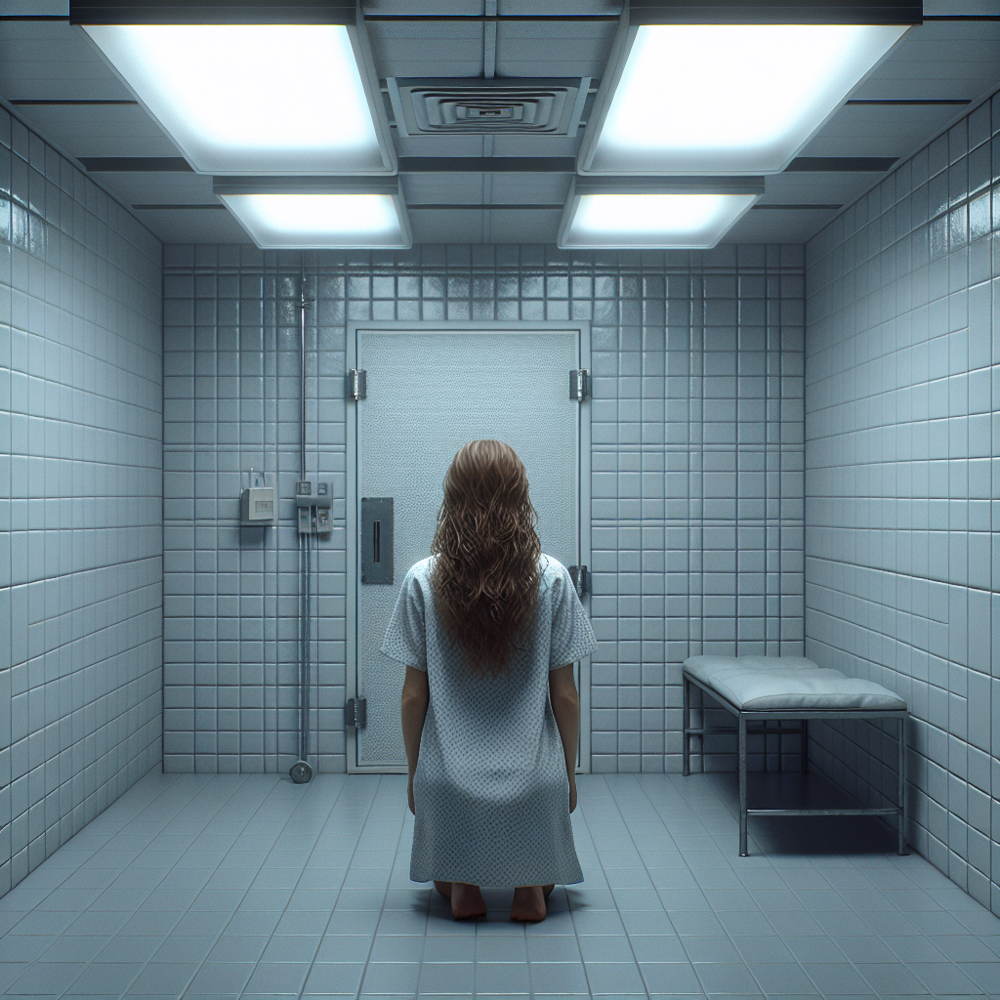

# StrAInger Things

AI Image generator from Stranger Things based prompts using DALLE-3 & GPT4-Vision

Using `gpt4-vision` to generate a prompt for `DALL·E 3`.

The backend consists of a Node.js / Express API application will allow the user to upload an image(s) and start processing them in a queue system.
 
The frontend is built with Angular 17.

## Background

**This is inpspired by [@jh3yy's](https://twitter.com/jh3yy) tweet: <https://twitter.com/jh3yy/status/1730596577067122956>.**

And some great ideas from: [Thomas Rosen's Lego Vision](https://github.com/thomasrosen/lego_vision>)

## Some Tips
Some tips:
- The fewer people the better - I would recommend 1-3 at most.
- Pick a good photo that shows your characteristics and isn't too blurry
- Sometimes a photo could get rejected because it is showing too much skin, or there is something copyright in it (hit or miss)
- It will almost always reject a photo of someone famous or if deemed against the OpenAI privacy policy

## Getting Started - Backend (Node.js)
### 1. Add a .env and your own API key

You need to add your own [OpenAI API key](https://beta.openai.com/docs/developer-quickstart/overview) to a `.env`-file.

The `.env`-file should look like this:

```bash
OPENAI_API_KEY="sk-xxxxxx"
PORT=3000
UPLOADS_DIR="./uploads/"
```

### 2. Install Dependencies

```bash
npm install
```

### 3. Run the server

Run the script / server using Nodemon 

```bash
npm start
```
or just by
```bash
node index.js
```

### 4. Upload and process some images
1. Upload an image: '/api/upload' (POST)
2. Add image to queue and process '/api/image/:fileName' (POST)
3. Get latest status as image processes / completes '/api/image/:imageName' (GET)

## Getting Started - Frontend - Angular 17 (optional)
### 1. Install Dependencies
```bash
npm install
```
### 2. Run the frontend
```bash
ng serve
```


## Examples
### The Upside Down




### Starcourt Mall




### Hawkins Lab


